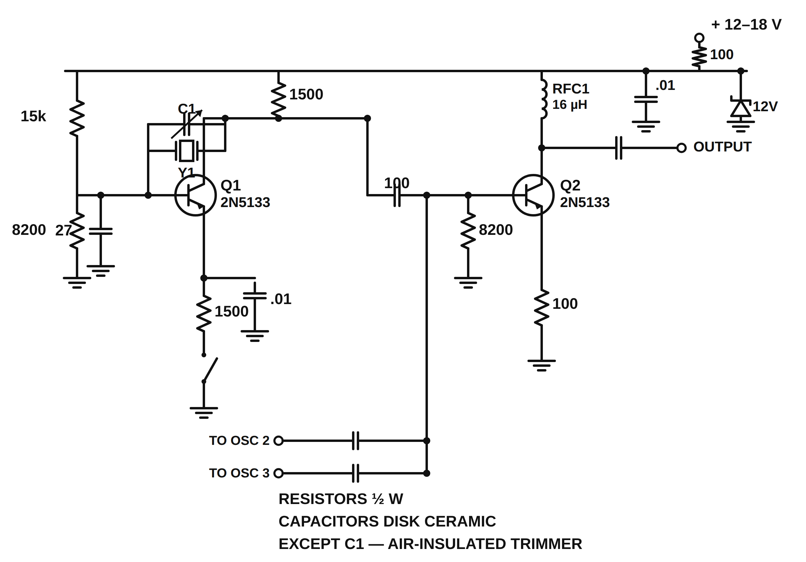

# Schematics

Computer-drawn (vector) versions of hand-drawn circuits.

## 1. Parallel circuit

A DC source **E** drives two resistors **R1** and **R2** connected in parallel.

- **I** — total current supplied by the source
- **I1** — current through **R1**
- **I2** — current through **R2**

By Kirchhoff's current law: **I = I1 + I2**, and both resistors see the full
source voltage, so **I1 = E / R1** and **I2 = E / R2**.

Files:
- `parallel-circuit.svg` — scalable source drawing
- `parallel-circuit.png` — rendered raster preview (2× scale)

## 2. Crystal oscillator / buffer

A two-stage circuit built from two **2N5133** transistors:

- **Q1** — crystal oscillator. Frequency set by crystal **Y1** with the
  air-insulated trimmer **C1** in parallel; base biased by the 15k / 8200
  divider; emitter degeneration via 1500 Ω (with a `.01` RF bypass) and an
  enable/keying switch to ground.
- **Q2** — buffer/amplifier. Driven from Q1 through the 100 pF coupling cap
  into a node that is also fed by external oscillators (**TO OSC 2/3**) and
  biased by the 8200 Ω resistor. Collector load is **RFC1** (16 µH) and the
  signal leaves through a coupling cap to **OUTPUT**.
- **Supply** — `+12–18 V` fed through a 100 Ω series resistor and regulated by
  a 12 V zener, with a `.01` decoupling cap.

Notes (from the original drawing): resistors are ½ W, capacitors are disk
ceramic, except **C1** which is an air-insulated trimmer.

Files:
- `oscillator.svg` — scalable source drawing
- `oscillator.png` — rendered raster preview (2× scale)
- `generate.js` — Node script that builds `oscillator.svg`
  (`node generate.js > oscillator.svg`)
