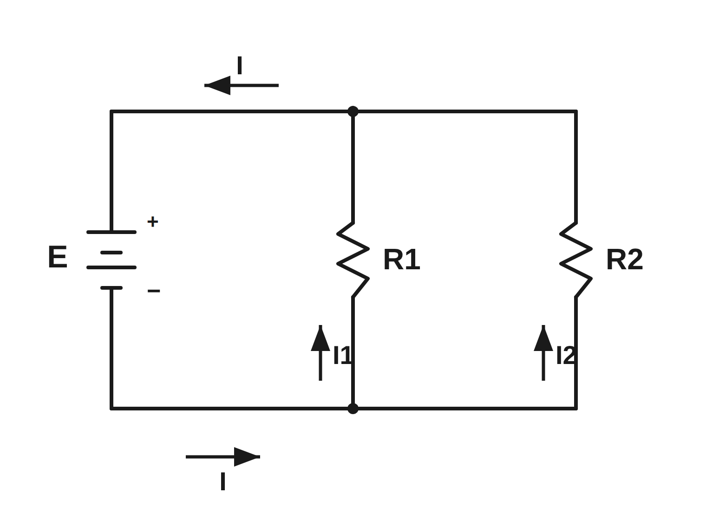

# Parallel Circuit Schematic

A computer-drawn (vector) version of the hand-drawn circuit.

## Circuit

A DC source **E** drives two resistors **R1** and **R2** connected in parallel.

- **I** — total current supplied by the source
- **I1** — current through **R1**
- **I2** — current through **R2**

By Kirchhoff's current law: **I = I1 + I2**, and both resistors see the full
source voltage, so **I1 = E / R1** and **I2 = E / R2**.

## Files

- `parallel-circuit.svg` — scalable source drawing (edit this)
- `parallel-circuit.png` — rendered raster preview (2× scale)
